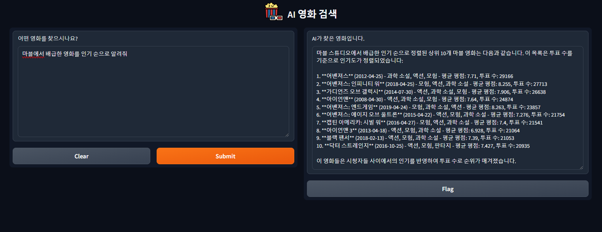

# 영화 검색기

GPT-4 기반 데이터에서 SQL 검색을 통한 영화 검색기입니다.

gpt-4-0125-preview 모델을 사용하였으며 캐글에 있는 Full TMDB Movies Dataset 2024 (1M Movies) 데이터셋을 사용했습니다.

SQLite를 사용해 데이터셋을 DB화 시켰으며, Gradio를 사용해 간단한 UI를 적용했습니다.

SQL 검색을 사용한 이유는 SQL 검색 시 소요되는 시간을 확인하기 위함이었으며, 최종 결과물 산출까지 소요되는 시간은 약 15초 내외였습니다.

